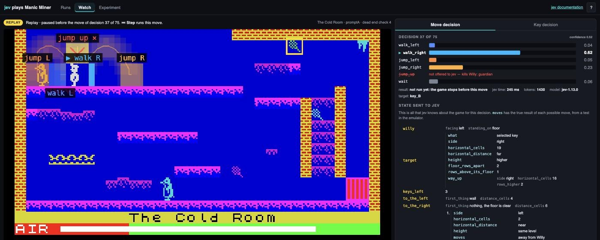

# jev plays Manic Miner

Manic Miner is a 1983 platform game for the ZX Spectrum. In each of its 20
caverns, Miner Willy must collect every key and then reach the exit portal.
He must not touch an enemy, fall too far, or run out of air.

[Jev](https://docs.typesafe.ai/introduction) is a decision model from
TypeSafe. It does not write text. It takes a state (a JSON object) and a
typed question, such as a Choice between some options. It returns a
probability for each option, and the option it selects. See "Jev" below.

This project asks one question: if the code only describes the game, can jev
make the decisions? The harness runs the game in an emulator and gives jev
the facts of each situation. Jev selects every move Willy makes, and the key
he goes for next.

## The answer in short: the harness does most of the work, but not all of it

We compared jev with a three-line rule that reads the same facts. Each arm
below is 10 runs of each of the 20 caverns, and we ran every arm twice
(28 September 2026):

| Decision maker for moves | Key choice | Complete runs of 200 (two runs) | Mean keys per run | Cost of 200 runs |
| --- | --- | --- | --- | --- |
| jev | the optimum order | 39, 33 | 1.8 | $0.95 |
| jev | jev selects | 32, 35 | 1.4 | $1.03 |
| jev | key rule `nearest` | 34, 27 | 1.5 | $0.86 |
| rule `nearer-memory` | key rule `nearest` | 25 | - | $0 |
| rule `nearer` | the optimum order | 19, 20 | 1.4 | $0 |
| rule `nearer-memory` | the optimum order | 19 | - | $0 |
| rule `nearer` | key rule `nearest` | 16, 18 | 1.1 | $0 |
| jev, move sampled from its probabilities | jev selects | 5, 7 | 1.0 | $1.10 |
| random valid move | the optimum order | 0, 0 | 0.3 | $0 |

The rule `nearer` picks a move that completes the cavern or collects a key.
If there is none, it picks a move whose `progress` is "nearer". If there is
none of those either, it picks any valid move. When several moves qualify,
it picks one of them at random. The rule `nearer-memory` also prefers a move
that Willy did not try from this place. The key rule `nearest` picks the key
nearest to Willy.

What the table shows:

- The harness does the route-finding. It removes every move that kills
  Willy, and `progress` says which moves go nearer to the target, the way
  up, or the way down. A three-line rule on these facts completes 16 to 20
  runs, and random choice among the same valid moves completes none.
- Jev adds value in two caverns. Over both runs, jev completes 72 of 400
  against the rule's 39 with the same key order (Fisher p = 0.001). All of
  the difference is in Wacky Amoebatrons (jev 9 and 8 of 10, the rule 1 and
  2) and Amoebatrons' Revenge (jev 6 and 7, the rule 0 and 1). In the other
  18 caverns there is no measurable difference.
- In Wacky Amoebatrons the rule moves back and forth at one place on the
  bottom floor until it is trapped, and jev moves on. Jev uses the guardian
  facts, which the rule ignores: without them, jev's result in the two
  caverns falls by about half (17 to 7, and 13 to 6 of 20). In the other 18
  caverns, jev does as well without the guardian facts. A rule that also
  reads the memory facts does a little better in the two caverns, but not
  nearly as well as jev.
- Jev's selected move matters. A move sampled from jev's probabilities
  completes only 5 to 7 runs.
- Without `progress`, jev completed only 5 of 200 runs (an earlier
  measurement, see "Results"). The route knowledge is in the harness.

An earlier measurement, on 26 September, gave the rule a key order that jev
did not need, and ran each arm once. It found 26 runs for jev against 24 for
the rule, and we first concluded that jev added almost nothing. The
like-for-like comparison, run twice, does not support that conclusion. See
"Jev and the rules: a like-for-like comparison" in
[docs/findings.md](docs/findings.md).

This is one game and one harness, and we did not test other people's demos.
But the test is easy to repeat for any demo: replace the model with a simple
rule over the same facts, like for like, repeat it, and compare. If the
results are close, the harness is doing the work.

Some measurements need older code, kept in the git tag `research-2026-09`
(see [docs/findings.md](docs/findings.md)).



A replay of The Cold Room, paused before decision 37. The coloured figures
on the game screen show where each of the 6 moves would take Willy. A red
cross marks a move that would kill him. Each bar on the right is the
probability that jev gave a move. Jev picked `walk_right` (0.62). `jump_up`
is not valid, because it kills Willy.

## Quick start

You need `uv`, `clang++`, and `make`. Watching the recorded runs needs no API
key.

```sh
uv sync
uv run make -C emulator                 # build the emulator module
uv run python -m jevmanic.server        # start the viewer
```

Open http://127.0.0.1:8000 and click a run. The Watch page replays it: the
game, each of jev's decisions, and everything jev was given. Replays make no
jev requests and cost nothing.

For a live run (jev plays a new game), you need a TypeSafe API key:

```sh
echo "TYPESAFE_API_KEY=your-key" > .env
```

Then click **Experiment** in the viewer, or use the terminal (see "Live runs
and measurements"). A live run costs about $0.005.

Run the tests (no jev requests) with `uv run pytest`.

## The project principle

The decisions come from jev. The harness gives facts and knowledge of the
game, but it never tells jev what to pick. It also never offers a move that
we know is not valid: a deadly move, a move into a dead end, or a move with
no effect.

Two parts of the design come close to the limit of this principle: the fact
`progress`, and one sentence about loops in the move text. See "Instruction
sets" in [docs/design.md](docs/design.md), which also explains how a
decision works and shows the exact data that jev receives.

## Jev

TypeSafe published jev in September 2026
([announcement](https://typesafe.ai/blog/introducing-system-one-models-and-jev)).
The claims in this section are TypeSafe's. We did not test them, except
where we give our own measurement.

- TypeSafe calls jev a "System One model": a model that makes fast,
  structured decisions that software can use directly. It does not generate
  text; the possible answers and their structure are fixed before the
  request.
- A request contains one or more typed questions. This project uses only
  **Choice** (pick one option from a list). Another type, **Noul**, gives
  the probability that a statement is true.
- Jev returns a probability for each option. TypeSafe says the
  probabilities are calibrated, and that it trains jev with reinforcement
  learning to achieve this.
- TypeSafe quotes a response time of 70 to 500 ms. Over 15110 move decisions
  with the defaults, our median was 268 ms, and 90 % took 344 ms or less.
- Input costs $0.042 per million tokens, and output is free. A move
  decision uses a median of 1358 input tokens.
- This project uses the model version `jev-1.13.0`.

Jev also returns a **confidence** for each answer. It is not the probability
of the selected option. According to the jev documentation, it measures how
the probability is spread across the options. All of it on one option gives
1.0, and a more even spread gives less. In the picture above, `walk_right`
has 0.62 and the confidence is 0.52. In a key decision of the same run,
`key_B` has 0.39, `key_E` 0.37, and `key_C` 0.24, and the confidence is only
0.08.

## Results

Settings for all columns: promptD, the key decision uses the map, the
dead-end check looks 4 moves ahead, and each cavern gets 10 live runs. The
table gives the first of the two runs on 28 September 2026.

- **jev**: jev selects every move and every key.
- **jev, optimum order**: the harness fixes the key order
  (`--key-order optimum`), and jev selects every move.
- **rule `nearer`, optimum order**: the rule instead of jev (`--rule
  nearer --key-order optimum`). No jev requests.
- **jev, key rule `nearest`**: the key nearest to Willy is the target
  (`--key-rule nearest`), and jev selects every move.
- **rule `nearer`, key rule `nearest`**: `--rule nearer --key-rule
  nearest`. No jev requests.
- **jev, sampled moves**: the move is drawn from jev's probabilities
  (`--sample-moves`).
- **random, optimum order**: a random valid move (`--random-moves
  --key-order optimum`). No jev requests.

Each cell shows complete runs out of 10 · mean keys per run.

| Cavern | jev | jev, optimum order | rule `nearer`, optimum order | jev, key rule `nearest` | rule `nearer`, key rule `nearest` | jev, sampled moves | random, optimum order |
| --- | --- | --- | --- | --- | --- | --- | --- |
| 1 Central Cavern (5 keys) | 10 · 5.0 | 9 · 4.5 | 7 · 5.0 | 10 · 5.0 | 9 · 4.5 | 0 · 2.0 | 0 · 0.1 |
| 2 The Cold Room (5 keys) | 1 · 2.6 | 8 · 4.8 | 9 · 4.6 | 6 · 4.6 | 4 · 3.3 | 1 · 2.3 | 0 · 1.3 |
| 3 The Menagerie (5 keys) | 2 · 2.8 | 5 · 3.9 | 2 · 1.6 | 1 · 2.3 | 1 · 2.6 | 0 · 1.3 | 0 · 0.2 |
| 4 Abandoned Uranium Workings (5 keys) | 1 · 0.9 | 0 · 0.4 | 0 · 0.0 | 0 · 3.0 | 0 · 2.2 | 0 · 1.5 | 0 · 0.2 |
| 5 Eugene's Lair (5 keys) | 0 · 2.2 | 0 · 2.0 | 0 · 2.3 | 0 · 2.1 | 0 · 2.0 | 0 · 0.6 | 0 · 0.2 |
| 6 Processing Plant (5 keys) | 0 · 2.8 | 0 · 3.4 | 0 · 0.0 | 0 · 2.0 | 0 · 0.0 | 0 · 2.0 | 0 · 0.7 |
| 7 The Vat (5 keys) | 0 · 0.0 | 0 · 0.0 | 0 · 0.0 | 0 · 0.0 | 0 · 0.0 | 0 · 0.0 | 0 · 0.0 |
| 8 Miner Willy meets the Kong Beast (4 keys) | 0 · 0.2 | 0 · 1.6 | 0 · 0.8 | 0 · 1.0 | 0 · 0.2 | 0 · 0.2 | 0 · 0.4 |
| 9 Wacky Amoebatrons (1 key) | 9 · 0.9 | 9 · 0.9 | 1 · 0.1 | 8 · 0.8 | 0 · 0.0 | 1 · 0.2 | 0 · 0.0 |
| 10 The Endorian Forest (5 keys) | 0 · 1.0 | 2 · 2.4 | 0 · 2.3 | 0 · 1.9 | 0 · 1.4 | 0 · 0.9 | 0 · 1.1 |
| 11 Attack of the Mutant Telephones (5 keys) | 0 · 0.0 | 0 · 3.2 | 0 · 2.1 | 0 · 0.0 | 0 · 0.0 | 2 · 1.0 | 0 · 0.0 |
| 12 Return of the Alien Kong Beast (5 keys) | 0 · 1.3 | 0 · 1.0 | 0 · 0.7 | 0 · 1.6 | 0 · 1.4 | 0 · 0.9 | 0 · 0.0 |
| 13 Ore Refinery (5 keys) | 0 · 1.5 | 0 · 1.8 | 0 · 1.0 | 0 · 0.4 | 0 · 0.0 | 0 · 1.2 | 0 · 0.4 |
| 14 Skylab Landing Bay (4 keys) | 0 · 1.6 | 0 · 0.2 | 0 · 0.9 | 0 · 1.0 | 0 · 0.0 | 0 · 0.8 | 0 · 0.2 |
| 15 The Bank (3 keys) | 0 · 1.0 | 0 · 1.1 | 0 · 1.0 | 0 · 0.0 | 0 · 0.0 | 0 · 1.3 | 0 · 0.1 |
| 16 The Sixteenth Cavern (4 keys) | 0 · 1.5 | 0 · 2.9 | 0 · 0.5 | 0 · 1.8 | 0 · 0.5 | 0 · 0.4 | 0 · 0.0 |
| 17 The Warehouse (5 keys) | 3 · 2.6 | 0 · 0.2 | 0 · 1.5 | 4 · 2.9 | 2 · 1.5 | 0 · 1.4 | 0 · 0.1 |
| 18 Amoebatrons' Revenge (1 key) | 6 · 0.6 | 6 · 0.7 | 0 · 0.0 | 5 · 0.5 | 0 · 0.0 | 1 · 0.1 | 0 · 0.0 |
| 19 Solar Power Generator (3 keys) | 0 · 0.0 | 0 · 0.8 | 0 · 1.0 | 0 · 0.0 | 0 · 0.0 | 0 · 0.0 | 0 · 0.0 |
| 20 The Final Barrier (5 keys) | 0 · 0.0 | 0 · 0.0 | 0 · 1.6 | 0 · 0.0 | 0 · 1.7 | 0 · 2.1 | 0 · 0.1 |
| All caverns | 32 · 1.4 | 39 · 1.8 | 19 · 1.4 | 34 · 1.5 | 16 · 1.1 | 5 · 1.0 | 0 · 0.3 |

### An earlier measurement (26 September 2026)

These arms ran at different times, with promptA. The columns marked (tag)
need the code in the tag `research-2026-09`. The "no `progress`" arm has no
`progress` and no `progress_measures` in the state, and its text does not
name them. The rule `nearer-new` prefers a nearer move to a new place, then
any nearer move, then any move to a new place.

| Cavern | jev | jev, optimum order | jev, no `progress` | rule `nearer` | rule `nearer-new` | random |
| --- | --- | --- | --- | --- | --- | --- |
| 1 Central Cavern (5 keys) | 10 · 5.0 | 10 · 5.0 | 0 · 4.4 | 10 · 5.0 | 8 · 4.2 | 0 · 0.0 |
| 2 The Cold Room (5 keys) | 1 · 2.3 | 7 · 4.3 | 0 · 1.8 | 7 · 4.0 | 4 · 3.0 | 0 · 0.6 |
| 3 The Menagerie (5 keys) | 8 · 4.7 | 1 · 2.3 | 1 · 2.0 | 5 · 3.1 | 4 · 2.6 | 0 · 0.2 |
| 4 Abandoned Uranium Workings (5 keys) | 0 · 0.0 | 0 · 0.0 | 0 · 2.5 | 0 · 0.0 | 0 · 0.0 | 0 · 0.4 |
| 5 Eugene's Lair (5 keys) | 0 · 2.2 | 0 · 1.9 | 0 · 0.2 | 0 · 2.1 | 0 · 2.4 | 0 · 0.8 |
| 6 Processing Plant (5 keys) | 0 · 2.8 | 0 · 2.7 | 0 · 4.5 | 0 · 0.2 | 0 · 0.0 | 0 · 0.8 |
| 7 The Vat (5 keys) | 0 · 0.0 | 0 · 0.0 | 0 · 1.2 | 0 · 0.0 | 0 · 0.0 | 0 · 0.0 |
| 8 Miner Willy meets the Kong Beast (4 keys) | 0 · 0.4 | 0 · 1.2 | 0 · 0.3 | 0 · 0.4 | 0 · 2.0 | 0 · 0.2 |
| 9 Wacky Amoebatrons (1 key) | 4 · 0.4 | 1 · 0.1 | 2 · 0.2 | 2 · 0.2 | 2 · 0.3 | 0 · 0.0 |
| 10 The Endorian Forest (5 keys) | 0 · 1.0 | 0 · 2.3 | 0 · 0.5 | 0 · 2.2 | 0 · 2.0 | 0 · 0.9 |
| 11 Attack of the Mutant Telephones (5 keys) | 0 · 0.0 | 1 · 2.2 | 0 · 0.0 | 0 · 1.3 | 0 · 1.7 | 0 · 0.0 |
| 12 Return of the Alien Kong Beast (5 keys) | 0 · 1.0 | 0 · 1.0 | 0 · 1.8 | 0 · 0.7 | 0 · 0.7 | 0 · 0.2 |
| 13 Ore Refinery (5 keys) | 0 · 0.9 | 0 · 1.0 | 0 · 0.9 | 0 · 1.0 | 0 · 1.0 | 0 · 0.1 |
| 14 Skylab Landing Bay (4 keys) | 0 · 1.2 | 0 · 0.1 | 0 · 1.2 | 0 · 1.0 | 0 · 1.0 | 0 · 0.2 |
| 15 The Bank (3 keys) | 0 · 1.4 | 0 · 1.6 | 0 · 2.0 | 0 · 1.2 | 0 · 1.0 | 0 · 0.1 |
| 16 The Sixteenth Cavern (4 keys) | 0 · 1.9 | 0 · 2.3 | 0 · 1.4 | 0 · 0.3 | 0 · 0.4 | 0 · 0.0 |
| 17 The Warehouse (5 keys) | 0 · 2.0 | 0 · 0.0 | 0 · 0.0 | 0 · 0.9 | 0 · 1.0 | 0 · 0.0 |
| 18 Amoebatrons' Revenge (1 key) | 8 · 0.8 | 6 · 0.6 | 2 · 0.2 | 0 · 0.0 | 0 · 0.0 | 0 · 0.0 |
| 19 Solar Power Generator (3 keys) | 0 · 0.0 | 0 · 1.0 | 0 · 0.0 | 0 · 0.9 | 0 · 1.0 | 0 · 0.2 |
| 20 The Final Barrier (5 keys) | 0 · 0.2 | 0 · 0.0 | 0 · 1.3 | 0 · 1.8 | 0 · 1.4 | 0 · 0.4 |
| All caverns | 31 · 1.4 | 26 · 1.5 | 5 · 1.3 | 24 · 1.3 | 18 · 1.3 | 0 · 0.3 |

What this shows:

- Random choice among the valid moves completes no cavern, so the choice
  between valid moves matters.
- In this measurement, the rule `nearer` did almost as well as jev (24
  against 26). The like-for-like comparison does not confirm this (19
  against 39, and 20 against 33). `nearer-new`, which also prefers new places, did worse (18
  complete runs).
- The key order affects each cavern differently. With the optimum order,
  jev completes The Cold Room 7 times in 10 (1 with its own order), but The
  Menagerie only once (8 with its own order).
- Without `progress`, jev collects almost as many keys (1.3 per run) but
  completes only 5 runs. In Central Cavern it collected all 5 keys in 7 of
  10 runs, then failed to find the way down to the portal and ended "stuck:
  no progress".
- With the defaults, jev collected no key at all in caverns 4, 7, and 11.
- In cavern 20, 9 of jev's 10 runs end with a death at decision 10. For the
  two decisions before it, only one move is valid, and after that every move
  kills Willy. A 4-move dead-end check sees this trap too late. The default
  stays at 4 moves rather than 12, because a deeper check does more of jev's
  work (see "The dead-end check" in [docs/findings.md](docs/findings.md)).
- One run of "jev, no `progress`" ended with a jev API server error.

Some caverns did better with two other settings: a key decision without the
map, and a 12-move dead-end check. With them, cavern 9 completed
10 of 10 runs and cavern 11 completed 5 of 10, and cavern 4 collected 4.0
keys per run. With the defaults, the numbers were 4, 0, and 0.0. We did not measure
which setting made the difference. See "Open work" in
[docs/findings.md](docs/findings.md).

### What we learned

- The harness finds the route. Jev adds value where a simple rule gets
  trapped: in two caverns, jev completes most runs and the rule almost none.
  In the other 18 caverns, jev and the rule do equally well.
- Compare like for like, and repeat the comparison. The first comparison
  gave the rule a key order and ran once, and its conclusion was wrong.
- Jev makes good single decisions but does not plan a route. When some move
  goes nearer to the target, jev picks one in 85 % of decisions. It fails
  when the direct way is blocked and Willy must first move away from the
  target. It also uses up crumbling floors that Willy needs later.
- The look-ahead removes every move that kills Willy directly. Deaths come
  from traps deeper than the dead-end check, as in cavern 20.
- Jev does not always give the same answer to the same state. When two
  options are close (0.47 and 0.44, say), two runs can go different ways, so
  10 runs per cavern reveal only large differences.
- A good key order needs a route plan across the whole map, and jev is weak
  at tasks with more than one step.

[docs/findings.md](docs/findings.md) has every measurement behind these
statements, with its settings.

## Other decision makers

We also gave the task to other models, with the same instructions, options,
and state as jev. These were small tests with few runs, using the settings
of the time. They show each model's character, not an exact ranking.
[docs/findings.md](docs/findings.md) has the details.

| Decision maker | What it is | Test | Result | One decision | One run |
| --- | --- | --- | --- | --- | --- |
| jev (`jev-1.13.0`) | TypeSafe's System One model, through its API | 10 runs of each cavern (see "Results") | 32 of 200 complete | 0.27 s | $0.005 |
| Claude Haiku | an LLM that reasons before each answer, through the `claude` command | 1 run of Central Cavern | complete in 123 decisions (jev: 70 to 75) | 17.8 s | $1.30 |
| Qwen3-8B, 4-bit | an open LLM on this computer; the answer is read from its logits | 1 run each of caverns 1 to 3 | The Menagerie complete (64 decisions); 0 and 2 keys in caverns 1 and 2 | 1.2 s | $0 |
| Laya | a small typed decision model (421 million parameters) on this computer | 10 runs each of caverns 1 to 3, with jev's request | no complete run; it cannot read the whole request | 0.05 s | $0 |
| A reasoning model as planner, jev as player | the planner sets the key order, and jev selects every move | 10 runs each of caverns 1 to 4 | 7, 6, 9, 0 complete (jev alone: 8 to 10, 4 to 6, 10, 0) | - | - |

Claude Haiku can complete a cavern from the same facts, but it is far slower
and costlier. The local models are completely sure of each answer (1.0
against 0.0), so once they enter a loop they repeat it until the run ends. A
good key order from the planner did not produce more complete runs.

## Questions and criticisms

Questions that people ask about game demos with jev, with answers from our
measurements.

**Is the code doing the work instead of jev?** Most of it (see "The answer
in short"). The harness removes every move that kills Willy or leads into a
dead end, and it computes `progress` toward the target, the way up, or the
way down. Without `progress`, jev completes 5 of 200 runs. But a rule that
reads only `progress` and the goal facts completes about half as many runs
as jev (39 against 72 over two runs), and all of that difference is in two
caverns. Jev picks a move that the rule could
also pick in 93 % of its decisions; a random valid move would do this in
54 %.

**Does the state mark the correct answer?** Not directly, but `progress`
comes close. The state never says which move is best. However, `progress`
has two adjustments for the way up and the way down, so it encodes the
route. With plain distances instead, jev completes no run in Central Cavern.
The rule shows how far the "nearer" fact alone gets. The harness also leaves
out moves that we know are not valid (see "Valid moves" in
[docs/design.md](docs/design.md)).

**Is every decision really jev's?** Each move decision is one jev request,
with two exceptions: only one move is valid, or all valid moves have the
same result (Willy is in the air). Then the harness makes no request, and the log
file and the viewer mark the decision "no jev call". The log file records
every request: the state, the question, and the answer.

**Did you cherry-pick the good runs?** The result tables include every run
of each measurement, and the summaries are in `experiments/results/`. The
runs in `demo/` are complete runs. They show what jev can do, not what it
usually does; most runs are not complete.

**Does jev see the game?** No. Jev reads only text. The harness reads the
game from the emulator's memory and gives jev facts relative to Willy. Jev
never gets a picture.

**Is jev's response time a problem?** No. The game pauses before each move
and waits for the decision. A move decision takes a median of 268 ms.

**Why not an LLM, a search, or a trained agent?** This project asks what jev
can do with facts alone. A search or a trained agent could play better, but
then the search or the training makes the decisions. Claude Haiku completed
Central Cavern from the same facts, but each decision took 17.8 s and the
run cost $1.30 (see "Other decision makers").

**Does jev give the same answer every time?** Mostly. We resent 200 recorded
move decisions unchanged, and 184 answers matched. When two options are
close (0.47 and 0.44, say), the answer can flip and two runs of the same
cavern diverge. That is why we report 10 or 20 runs, never one.

**Does the order of the options change the answer?** A little. With the
options reordered, 172 to 174 of the 200 answers matched (184 with no
change). Jev has no bias toward the first option: in the normal order, it
picked the first option in 51 of 200 decisions, which is what chance gives.
When we also reversed the entries in `moves`, only 144 of 200 matched, with
no pattern in the changes. The harness always lists the moves in the same
order. `experiments/probe_option_order.py` runs this test (about $0.05).

**Are jev's probabilities calibrated?** TypeSafe says so; we did not test
it. We did see that the spread of jev's probabilities helps. A local model
that is always completely sure repeats a loop until the run ends (see "Other
decision makers").

**Is jev an LLM?** TypeSafe says no, because jev does not generate language.
TypeSafe has not published the architecture.

## The viewer

```sh
uv run python -m jevmanic.server
```

Open http://127.0.0.1:8000. The menu has three pages:

- **Runs**: all recorded runs, with filters, and the complete runs per
  cavern. Tick two runs to compare them.
- **Watch**: one run: the game, each of jev's decisions with its
  probabilities, and everything jev was given. Click the timeline to jump to
  a decision.
- **Experiment**: ask jev one key question for a situation you set up,
  start a live run, or write a new instruction set.

Two more pages open from these: **Compare** (from Runs) and **Instruction
sets** (from Experiment). [docs/viewer.md](docs/viewer.md) describes each
page, with screenshots.

## Live runs and measurements

A live run needs the API key in `.env` (see "Quick start").

```sh
uv run python -m jevmanic.cli --cavern 2
uv run python -m jevmanic.cli --cavern 2 --until-complete
uv run python -m jevmanic.cli --cavern 2 --rule nearer --key-order optimum   # no jev requests
uv run python -m jevmanic.cli --help                      # all options
```

Caverns are numbered 1 to 20. With `--until-complete`, the script plays
again until a run is complete (at most 10 runs). Every live run writes a log
file to `runs/`, which the viewer can replay.

A measurement plays many live runs in parallel and prints a table: complete
runs, keys, decisions, tokens, and the share of decisions with a confidence
below 0.5. Because jev does not always answer the same state the same way,
one run tells you little, and even 10 runs per cavern show only large
differences.

```sh
uv run python -m experiments.measure --caverns 1,2 --runs 10 --label my-test
uv run python -m experiments.measure --caverns 1,2 --runs 10 --label old-text --instructions promptA
uv run python -m experiments.diagnose runs/my-test/<file>.jsonl
```

The terminal runner and the measurement tool share these run options. Each
one changes a single part of the design, so you can measure its effect:

| Option | Effect |
| --- | --- |
| `--instructions NAME` | the instruction set: `promptD` (default), `promptA` (used for the results), or your own |
| `--facts-only-keys` | the key decision gets the facts only, without the map |
| `--key-every N` | repeat the key decision every N decisions (default 25; 0 = never) |
| `--depth N` | how many moves the dead-end check looks ahead (default 4; 0 = off) |
| `--key-order LETTERS` | the harness fixes the key order, and there is no key decision. `optimum` uses the cavern's optimum order. |
| `--random-moves` | a random valid move, for comparison |
| `--rule NAME` | a rule instead of jev, for comparison (no jev requests): `nearer`, or `nearer-memory`, which also prefers a move not tried from this place |
| `--key-rule nearest` | the key nearest to Willy instead of jev's key decision, for comparison (no jev request) |
| `--no-guardian-facts` | the move decision's state has no guardian facts, for comparison |
| `--sample-moves` | play a move drawn from jev's probabilities instead of jev's selected move, for comparison |
| `--llm MODEL`, `--local [MODEL]`, `--laya` | another decision maker, for comparison (see "Other decision makers"). Only the terminal runner has `--llm`. |

With `--facts-only-keys`, jev also gets a key decision after 12 decisions
without a new place, and after Willy changes floor level.

Before the runs start, the measurement tool runs the request checks
(`jevmanic/checks.py`). They replay three recorded runs, build the states
with the measurement's settings, and stop the measurement if:

- a text mentions a field (in back quotes) that the state never contains;
- a move fact (`movement`, `collects_key`, or a map after the move) does not
  match the game at the end of that move.

`tests/test_checks.py` runs the same checks for every instruction set and
shows that each check catches a known problem. The checks have two limits.
They check field names, not where the fields sit in the state: `warning`
passes if any part of the state has it. And they cannot tell whether a
sentence in a text is true. `--skip-checks` skips them.

Log files go to `runs/<label>/`, and the viewer shows them as the group
"Measurement: label". `experiments/diagnose.py` prints the map, the last
positions, and the last state of one run. The summaries behind this README's
tables are in `experiments/results/`.

## Limits

- The state has no facts about the special enemies: Eugene (cavern 5), the
  Kong Beast (caverns 8 and 12), the Skylabs (cavern 14), and the light beam
  in cavern 19. The look-ahead still removes any move they make deadly,
  because it runs the real game.
- The harness reads the vertical guardians, but the state leaves them out,
  because facts about them made the results worse. We did not measure the
  effect of the switch facts.
- The cause of a death (guardian or nasty) is a guess from the positions at
  the moment of death.
- The results come from 10 runs per cavern, so they are not exact.

## Terms

Each term has one meaning in this project. Some code names are older; the
last column lists them.

### The game

| Term | Meaning | Names in the code |
| --- | --- | --- |
| cavern | One level of the game. This README numbers them 1 to 20; the code numbers them 0 to 19. | `cavern` |
| Willy | The miner that the player controls. He is 2 cells wide and 2 cells high. He can jump at most 2 rows up, and a fall of 5 rows or more kills him. | |
| cell | One square of the cavern grid (32 × 16 cells). A row is one line of cells. | |
| key | An item that Willy must collect. A cavern has 1 to 5 keys, lettered A to E. Only a game item is a "key"; a keyboard or joystick button is an "input". | |
| switch | A lever in caverns 8 and 12. Willy flips it to change the cavern. | |
| portal | The exit. It opens when Willy has all the keys. | |
| guardian | An enemy that moves along a fixed path. It kills Willy on contact. | |
| nasty | A hazard that does not move. It kills Willy on contact. | |
| crumbling floor | A floor that breaks a little each time Willy stands on it. | |
| conveyor | A floor that carries Willy left or right. | |
| air | A supply that runs down all the time. Willy dies when it runs out. | |

### A run

| Term | Meaning | Names in the code |
| --- | --- | --- |
| move | One of Willy's six fixed actions: `walk_left`, `walk_right`, `jump_left`, `jump_right`, `jump_up`, `wait`. A move ends when Willy is on the ground and aligned with the grid. | `macro` |
| valid move | A move that the harness offers to jev. A move is not valid if it is deadly, leads into a dead end, or has no effect. | `offered` |
| deadly move | A move that kills Willy before it ends. | `dead` |
| dead end | A place where Willy is still alive but cannot stay alive. The dead-end check finds it. | `DEAD_END_CAUSE` |
| target | The key or switch that Willy is heading for, or the portal once no key is left. | `target` |
| decision | One step of a run: one move is selected and played. Most decisions need one jev request; a forced decision needs none. | `n`, record type `decision` |
| forced decision | A decision without a jev request, because only one move is valid or all valid moves have the same result. | `forced` |
| move decision | The decision that selects the next move. | |
| key decision | The decision that selects the target. It happens at the start, after Willy collects a key or flips a switch, and again every 25 decisions. | record type `target`, header field `target_questions` |
| run | One game in one cavern, from the start to its outcome. | |
| outcome | How a run ends: "cavern complete", "Willy died", "stuck: no progress" (no new place and no new key in 30 decisions), or "decision limit" (400 decisions). | `outcome` |
| complete run | A run with the outcome "cavern complete". | |
| live run | A run that asks the decision maker for every decision and writes a log file. | |
| replay | A run that plays back a log file. It makes no jev requests. | |
| log file | The JSON Lines record of one live run, in `runs/` or `demo/`. | |
| measurement | A set of live runs under one label, from `experiments/measure.py`. | |

### What jev gets

| Term | Meaning | Names in the code |
| --- | --- | --- |
| harness | All the code around jev: the emulator, the facts, the dead-end check, and the choice of valid moves. | |
| request | One call to the jev API, with a state and one question. | |
| state | The JSON object that jev receives in a request. (The emulator's saved copies of the game are "save slots".) | |
| fact | One field of the state, such as `progress`. | |
| question | The typed question in a request. This project uses only Choice questions. | `Choice` |
| option | One answer that jev can select: a move, or a key or switch. | `criteria` |
| instruction set | A folder in `jevmanic/instructions/` with the three texts of one version: `promptA`, `promptC`, or `promptD`. | `instructions` setting |
| text | One file of an instruction set. Jev receives it as the question's `instructions`. | |
| probability | The share that jev gives to one option. | `probabilities` |
| confidence | Jev's measure of how the probability is spread across the options. It is not the probability of the selected option. | `confidence` |

### This project

| Term | Meaning |
| --- | --- |
| project principle | The decisions come from jev. The harness gives facts and knowledge of the game, and never tells jev what to pick. |
| decision maker | Whatever selects a move or a key: jev, a rule, random choice, or another model. |
| rule | A simple decision maker used for comparison, such as the rule `nearer`. It makes no jev requests. "Rule" has no other meaning in this project. |
| dead-end check | The search that finds dead ends (`--depth`). |
| request checks | The tests in `jevmanic/checks.py` that run before a measurement. |
| optimum order | The key order in `jevmanic/key_orders.py`. It is a good reference order, not a proven best one. |

## Files

| Path | Contents |
| --- | --- |
| `emulator/` | the ZX Spectrum emulator (C++) and its pybind11 binding `env.cpp` |
| `roms/ManicMiner.z80` | the game snapshot |
| `jevmanic/game.py` | cavern start, memory reads, moves, look-ahead, dead-end check |
| `jevmanic/describe.py` | the state: the map, the key facts, and the move facts |
| `jevmanic/brain.py` | the questions and the jev requests |
| `jevmanic/instructions/` | the instruction sets: `promptD/` (default), `promptA/`, `promptC/`, and any you add |
| `jevmanic/llm_brain.py`, `laya_brain.py`, `local_brain.py` | other decision makers, for comparison |
| `jevmanic/runner.py` | settings, live runs, log files, and replays |
| `jevmanic/options.py` | the run options shared by the terminal runner and the measurement tool |
| `jevmanic/server.py`, `jevmanic/web/` | the viewer |
| `jevmanic/lab.py` | the viewer's key decision lab |
| `jevmanic/key_orders.py` | the optimum key order of each cavern |
| `jevmanic/cli.py` | live runs in the terminal |
| `jevmanic/checks.py` | the request checks |
| `experiments/` | the measurement tool, the diagnosis script, the option-order test, the agreement count (`agreement.py`), and the paired test (`paired_rollouts.py`) |
| `experiments/results/` | the summaries behind this README's tables (other summaries are in the tag `research-2026-09`) |
| `docs/design.md` | the present design, the exact data that jev receives, and the log file format |
| `docs/findings.md` | the measurements behind the design |
| `docs/viewer.md` | the viewer's pages |
| `docs/planner-subagent.md` | the test with a reasoning model as planner |
| `docs/screenshots/` | screenshots of the viewer |
| `demo/` | one complete recorded jev run each for caverns 1, 2, 3, 9, and 18 (in git) |
| `runs/` | your log files (JSON Lines), not in git |

The emulator core comes from the esp32-zxspectrum project, which took it
from [OpenVegaPlus](https://github.com/alvaroalea/OpenVegaPlus).
