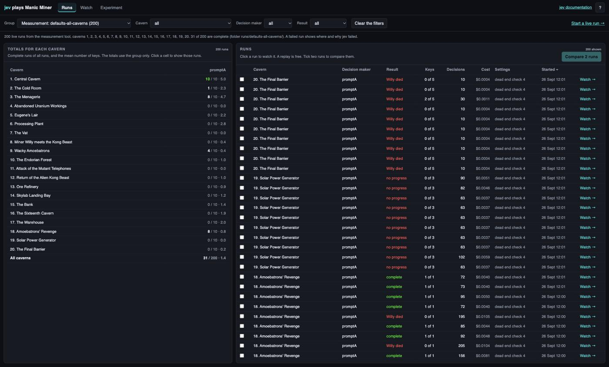
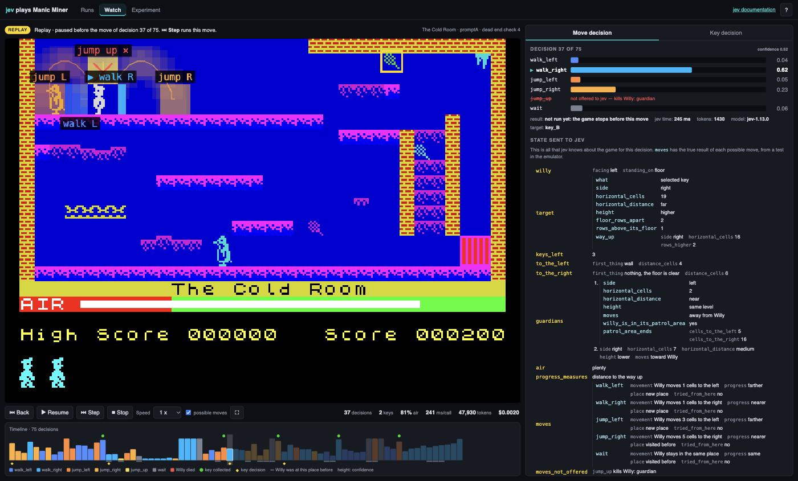
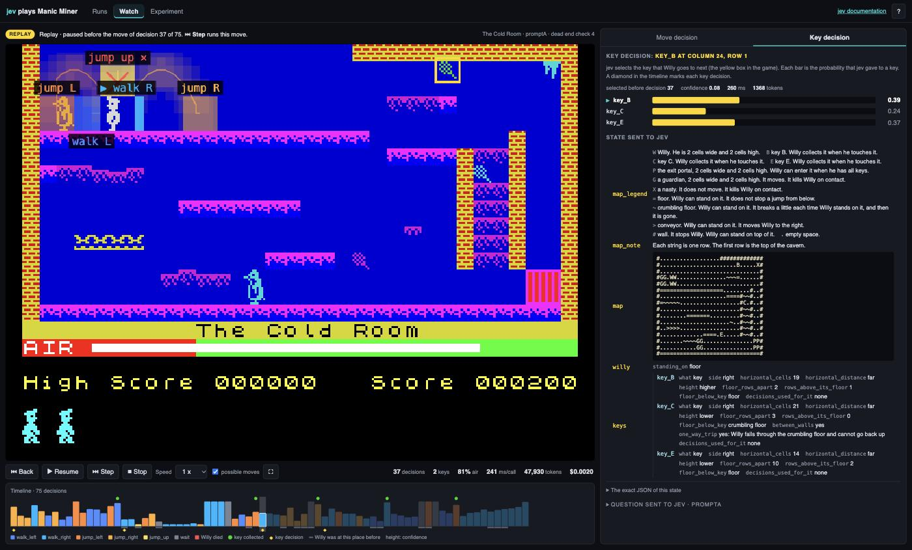
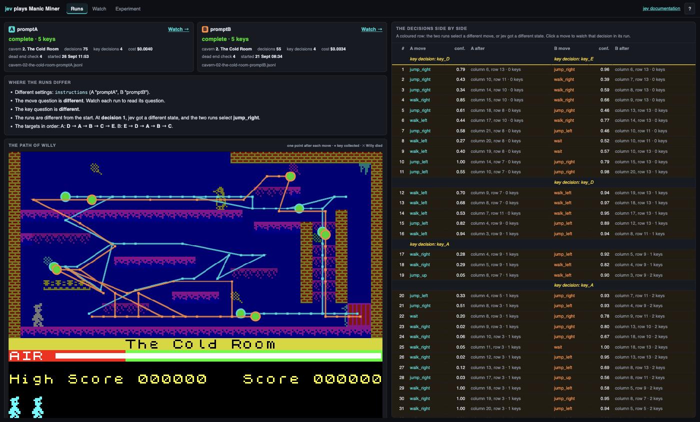
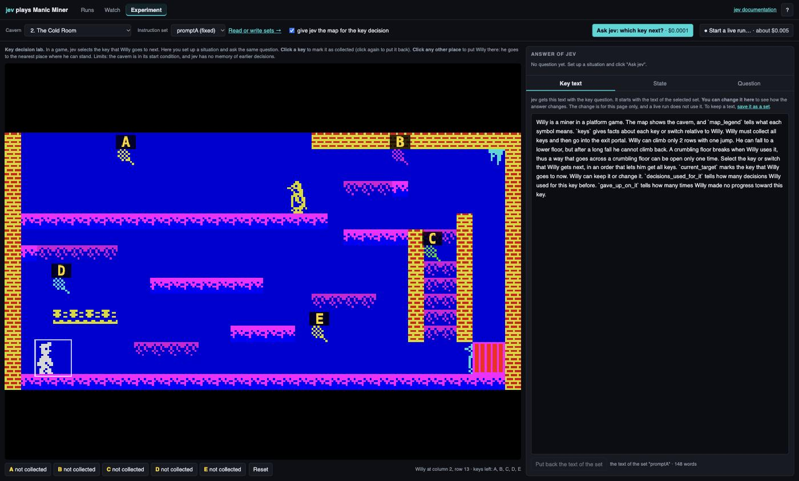
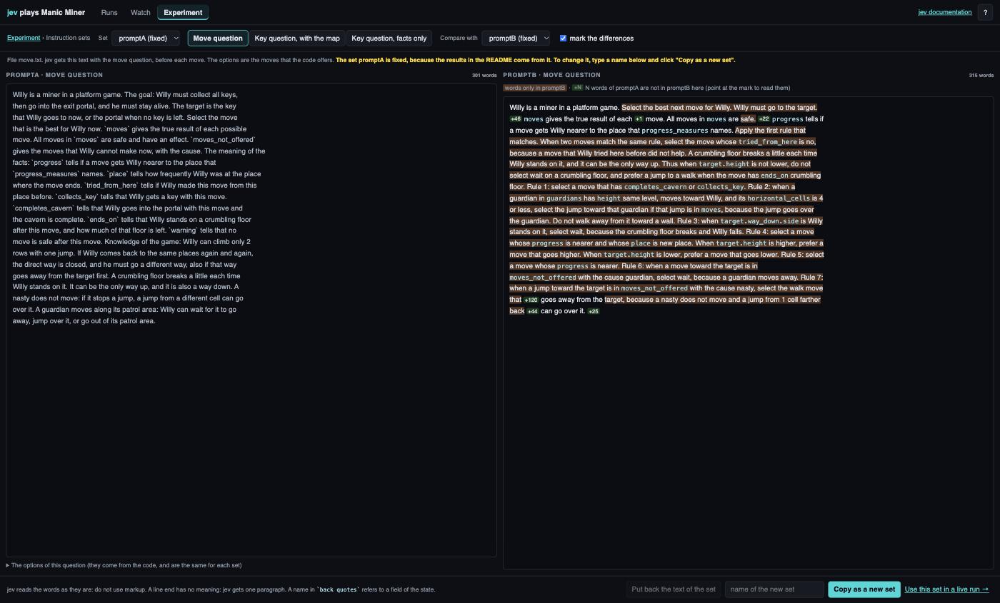

# The viewer

The viewer is a web page. It shows recorded runs and live runs, each decision
of jev, and all data that goes to jev. The [README](../README.md) explains the
project and the terms.

```sh
uv run python -m jevmanic.server
```

Open http://127.0.0.1:8000. The menu has three pages: **Runs**, **Watch**, and
**Experiment**. Two more pages open from them: **Compare** (from Runs) and
**Instruction sets** (from Experiment). Each page fills the window, and only
the panels scroll. The button **?** tells how the viewer works.

A replay is free. It makes no jev calls, and it needs no API key. The
emulator is deterministic, thus a replay is always the same game. A live run
and a question in the lab call jev.

## Runs

The page Runs (`/`) shows all recorded runs.



- The filters are the group, the cavern, the decision maker (for example
  `promptA`), and the result. The address of the page keeps the filters.
  Thus a reload or a link shows the same runs.
- There are three types of group:
  - **Saved example runs**: complete runs in the folder `demo/`. The page
    shows this group first.
  - **Your live runs**: the runs that you start (folder `runs/`).
  - **Measurement: name**: the runs of one measurement (folder
    `runs/name/`). A failed run shows where and why jev failed.
- **Totals for each cavern** has one row for each cavern and one column for
  each decision maker. A cell gives the complete runs, all runs, and the mean
  number of keys. The totals use only the group filter. Click a cell to show
  those runs. The groups have different settings. Thus the totals of "all
  groups" mix different settings. To compare settings, select one group.
- The list of runs gives the result, the keys, the decisions, the cost, and
  the settings of each run. Click a column title to sort the list. Click a
  run to watch it. To compare two runs, tick them and click **Compare 2
  runs**.

## Watch

The page Watch (`/watch?file=...`) shows one run.



The game screen is on the left. The controls, the statistics, and the
timeline are below the game screen. The data of jev is on the right.

- The timeline has one column for each move decision. The colour of a column
  is the selected move. The height is the confidence. The marks:
  - a red column: Willy died;
  - a green dot: Willy collected a key;
  - a yellow diamond: a key decision;
  - a grey line: Willy was at this place before. A series of grey lines shows
    that Willy goes back and forth.
- In a replay, the page gets all decisions from the log file first. Thus the
  timeline is complete at the start. Click the timeline, or drag along it, to
  go to a decision. The server plays the run up to that decision with no
  delay, and the game stops there. In a live run, a click on the timeline
  shows an earlier decision.
- The controls are **Back**, **Pause**, **Step**, **Stop**, and **Speed**.
  The game stops after a decision and before its move. Thus you see the
  selection of jev before the move occurs. A pause starts at the next
  decision. The line above the game tells when the game stops.
- The keys: Space pauses or resumes. The right arrow runs one move. The left
  arrow goes back one decision (a replay only). F sets full screen.
- **possible moves**: during a pause, the game screen shows the path of Willy
  for each of the 6 macros. Each path is a line of faded figures of Willy in
  the colour of the macro, one figure for each 2 game ticks. The selected
  macro is the brightest, and it has the mark ▶. A red cross marks a move
  that kills Willy. Each label goes to a free place near the end of its path.
  The paths are for the viewer only. They do not go to jev or to the log
  file.

The two tabs on the right show all data that goes to jev:

- **Move decision**: the probability of each macro, the selected macro, and
  the confidence. Each macro that jev did not get, with the cause. The time
  of the jev call and the input tokens. The state and the move question.
- **Key decision**: the last key decision before the decision on the screen.
  It gives the key or switch that jev selected as the target (a yellow box in
  the game), and the probability of each key. It also gives the state (with
  the map as rows) and the key question. The state is from the time of the
  key decision. Thus the map can be different from the game screen.



The page shows each field of a state with its value, so that a person can
read it. The exact JSON is below it. A question shows its instructions as a
paragraph and its options, with the exact JSON below them.

## Compare

The page Compare (`/compare?a=...&b=...`) shows two recorded runs, A and B.



- The result, the keys, and the settings of each run.
- The differences between the runs: the settings, the questions, and the
  first decision where jev got a different state or selected a different
  move. For that decision, the page gives the probabilities of the two moves.
- The path of Willy on the cavern for each run, with the collected keys and
  the place of a death.
- The two timelines, and a table with the decisions of the two runs side by
  side. Click a move to watch that decision in its run.

## Experiment

On the page Experiment (`/experiment`), select the cavern, the instruction
set, and the map setting at the top. Then you can do one of two things.



- **Ask jev: which key next?** asks the key question of a live run for a
  situation that you set up. This is the key decision lab. One question is
  one jev call (approximately $0.0001).
  - Click a key to mark it as collected. Click a different place to put
    Willy there.
  - The page shows the probabilities, the state with the map, the question,
    and the next key of the optimum order for comparison.
  - In the tab **Key text**, you can change the instruction text and see how
    the answer changes. The page does not save the change.
  - Limits: the cavern is in its start condition, and jev has no memory of
    earlier decisions.
- **Start a live run…** opens the settings that only a live run uses. One
  run costs approximately $0.005.
  - Who selects the next key: jev, or a fixed order. The fixed order starts
    with the optimum order of the cavern.
  - The depth of the dead end check. The default is 4 moves.
  - The run starts on the page Watch. A reload of that page replays the run.
    It does not start a second live run.

**Read or write sets →** opens the page Instruction sets (`/instructions`).



- The page shows the 3 texts of each set: the move question (`move.txt`),
  the key question with the map (`key.txt`), and the key question with the
  facts only (`key_facts_only.txt`). It also gives the word count and the
  options of the question.
- **Compare with** shows a second set on the right, as the one paragraph that
  jev gets. With **mark the differences**, the words that are only in the set
  on the right are orange. A green mark such as **+12** shows where the set on
  the left has 12 words that the set on the right does not have. Put the
  pointer on the mark to read those words.
- The sets `promptA`, `promptB`, and `promptC` are fixed, because the results
  in the README and in findings.md come from them. You cannot change a fixed
  set. **Copy as a new set** makes a copy that you can change.
- **Save as a new set** writes a new folder in `jevmanic/instructions/`. Then
  the live run, the lab, the terminal, and the measurement can use the new set
  (`--instructions NAME`). Measure a new set before you use it (see "Live runs
  and measurements" in the README).
- If you try to leave the page with a change that is not saved, the browser
  asks you first.
